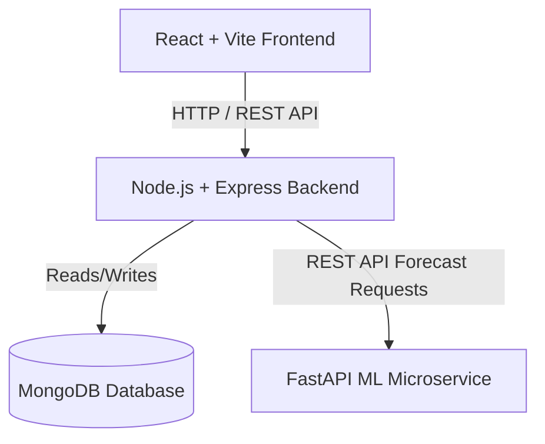
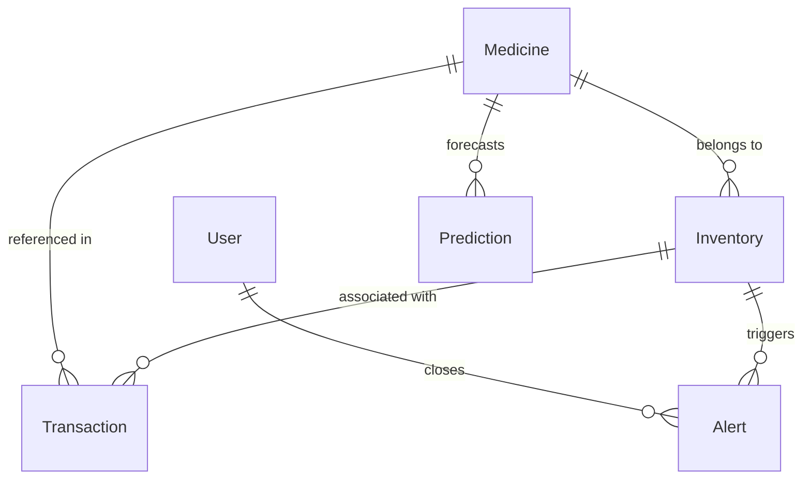
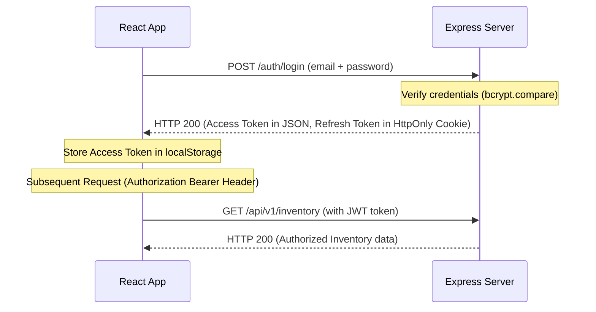

# Interview Preparation Guide: Medical Inventory Prediction System

Welcome to the **Medical Inventory Prediction System** study and interview guide. This document serves as a reference for architecture review, code design walkthroughs, database relationships, and SDE interview questions and answers.

---

## 1. Executive Summary & Design Goals
This project is a web application designed for hospital pharmacies and medical centers. Its core goals are to:
- **Minimize Stock-outs**: Identify low-stock items before they run out using AI-based demand predictions.
- **Reduce Waste**: Prevent expired medicine inventory by issuing automated alerts for nearing expiry dates.
- **Provide Financial Auditing**: Log and track revenue, costs, and profit for every inventory transaction.
- **Optimize Staff Performance**: Track and reward pharmacists/admins based on their real-time sales transactions.

---

## 2. System Architecture & Microservice Boundaries

The system is organized into decoupled services that run inside containerized environments:



### Decoupled Service Layout
1. **Frontend (`client`)**:
   - Single Page Application (SPA) built with **React** and bundled via **Vite**.
   - Styled using **Tailwind CSS**.
   - Uses **React Router** for route protection and app navigation.
   - Fetches and caches server state via an **Axios/Fetch API** client wrapper.
2. **Backend Server (`server`)**:
   - Built with **Node.js** and **Express.js**.
   - Orchestrates RESTful endpoints, handles security, runs background jobs, and manages database integration.
   - Employs **JWT (JSON Web Token)** authorization.
3. **Machine Learning Service (`ml-service`)**:
   - Deployed as a Python-based **FastAPI** microservice.
   - Exposes predictions via a `/predict` HTTP endpoint.
   - *Architecture Isolation*: Separating ML code into a Python environment keeps heavy mathematical packages (NumPy, Scikit-learn) isolated, allowing independent scaling and hosting on compute-optimized instances.
4. **Database (`mongo`)**:
   - Document-oriented NoSQL database (**MongoDB 7**) managed via **Mongoose**.
   - Handles schemas, validators, and database indexes.

---

## 3. Database Schema & Relations

The data schema models a transactional pharmacy ledger:



### Models & Collections
- **`User`**: Admin and Pharmacist user records. Stores credentials safely using bcrypt hashes.
- **`Medicine`**: The master catalog. Fields: `name`, `sku` (unique), `brand`, `description`, `buyingPrice` (INR), `sellingPrice` (INR), `leadTimeDays`.
- **`Inventory`**: Active stock batches. Fields: `medicine` (ref: Medicine), `batchNumber`, `currentStock`, `reorderLevel`, `expiryDate`.
- **`Transaction`**: The financial ledger of all items. Fields: `medicine` (ref: Medicine), `inventory` (ref: Inventory), `quantity`, `type` (`IN` / `OUT`), `unitBuyPrice`, `unitSellPrice`, `totalCost`, `totalRevenue`, `profit`, `note`.
- **`Alert`**: System warnings. Fields: `inventory` (ref: Inventory), `type` (`LOW_STOCK` / `EXPIRY_WARNING`), `message`, `isResolved`, `severity` (`Low` / `Medium` / `High`), `closedAt`, `closedBy` (ref: User).
- **`Prediction`**: History of demand forecasts. Fields: `medicine` (ref: Medicine), `predictedDemand` (Array), `confidence`, `source`.
- **`Staff`**: Pharmacist profiles and sales metrics. Fields: `name`, `email` (unique), `position`, `department`, `salary`, `status`, `totalSales` (INR revenue).

### Indexes (`database/indexes.js`)
To guarantee fast query execution as the ledger grows, indexing is set up:
- `medicines`: Index on `name` (searches/autocompletion).
- `inventories`: Indexes on `expiryDate` (first-to-expire queries) and `currentStock` (low stock detection).
- `transactions`, `alerts`: Indexes on `createdAt` desc (dashboard feeds).

---

## 4. End-to-End Workflows

### 4.1 Authentication & Secure Session Lifecycle


### 4.2 Sale Recording & KPI Synchronization (`sellStock`)
When a sale is recorded:
1. **Stock Check**: The server finds the inventory batch and verifies that `batch.currentStock >= quantity`.
2. **Deduction**: Decrements `batch.currentStock` by the sold quantity and updates the database.
3. **Transaction Logging**: Computes:
   - `totalCost = buyingPrice * quantity`
   - `totalRevenue = sellingPrice * quantity`
   - `profit = totalRevenue - totalCost`
   Logs a new transaction ledger record of type `OUT`.
4. **Staff Sales Accumulation**: If the logged-in user has an active `Staff` profile matching their email (`req.user.email`), increments their `totalSales` by `totalRevenue` in real-time.

### 4.3 Background Alert Cron Job (`alertJob`)
Runs every hour using `node-cron`:
1. Scans all active inventory records.
2. Checks if `currentStock <= reorderLevel`. If true, queries database for active unresolved alerts for this batch and alert type. If none exists, creates a `LOW_STOCK` alert.
3. Checks if `expiryDate` is within 30 days. If true, queries for existing unresolved warnings. If none, creates an `EXPIRY_WARNING` alert with a severity level mapped to remaining days.
*Spam Protection*: Prioritizing database queries for active unresolved alerts avoids redundant database growth and alert fatigue.

### 4.4 AI Prediction & Microservice Fallback
1. **Dynamic Catalog**: The frontend React app fetches the registered medicines dynamically and populates the selection dropdown.
2. **Forecast Request**: The client sends a POST request with `medicineId` to the backend `/api/v1/predictions`.
3. **Aggregation**: The backend sums up the `currentStock` across all inventory batches for the requested medicine.
4. **ML Microservice Fetch**: The backend server requests forecasting from the external ML service.
5. **Fallback Pattern**:
   - If the external microservice is online, it responds with the prediction.
   - If the microservice is unreachable, the backend catches the error, logs a warning, and runs a statistical generator (simulating demand based on typical baseline ranges and standard deviations) returning a successful forecast response.
6. **Recommendation Calculation**: The backend calculates a recommended stock level (using a 20% safety margin buffer: `predictedDemand * 1.2`), logs the prediction history, and returns it to the client.

### 4.5 Search Autocomplete & Stock Preloading
To simplify drug inventory tracking:
1. **Catalog Matching**: On load, `Inventory.jsx` fetches all catalog medicines. When typing a medicine name, it runs a case-insensitive substring match filter and presents a floating autocomplete suggestion list.
2. **Field Auto-population**: Selecting a suggestion fills the name, brand, description, and prices.
3. **Total Stock Preloading**: Simultaneously, the system queries the active stock list, filters it by the chosen medicine, sums up the `currentStock` of all existing batches, and pre-populates the "Current Stock" input.
4. **Searchable Sell List**: The `Sell.jsx` page replaces standard `<select>` lists with a text input. It filters matches (on name, brand, or batch number) dynamically to select the exact batch.

### 4.6 Front-End Quantity Safety Checks
To prevent negative stock entry:
1. Before submitting a sale transaction, the client validates if the typed quantity is greater than the selected batch's available stock.
2. If true, the system prevents form submit, displays a validation error card, and triggers a native browser `window.alert()` warning.

### 4.7 Delayed Alert Closing with Undo Action
To prevent accidental alert resolution and improve user control:
1. **Countdown Interval**: When a user clicks "Close Alert", instead of dispatching the API request immediately, the system registers a 5-second countdown timer in local component state.
2. **Timer Display**: The alert card switches to an active countdown state showing: `Alert closed. Disappearing in X seconds...`.
3. **Undo Handler**: An "Undo Action" button is rendered. Clicking this clears the countdown interval, deletes the pending resolution state, and restores the alert to its active, normal view.
4. **Resolution Dispatch**: If the timer reaches 0, the system automatically dispatches the backend `api.closeAlert(id)` request and refreshes the alerts list.

---

## 5. Non-Functional Engineering Decisions

### 5.1 Express Async Error Isolation (`asyncHandler`)
In standard Express, an unhandled rejection in an asynchronous middleware will crash the server. We implemented `server/src/utils/asyncHandler.js`:
```javascript
export const asyncHandler = (fn) => (req, res, next) => {
  Promise.resolve(fn(req, res, next)).catch(next);
};
```
By wrapping our controllers in this utility, thrown errors are forwarded to the global error middleware automatically, keeping the API server alive and logging errors in structured JSON.

### 5.2 XSS & CSRF Token Security
- **Access Tokens**: Short-lived (15 minutes) and stored in local memory/state, passed via `Authorization: Bearer <token>` headers to protect against CSRF.
- **Refresh Tokens**: Longer-lived (7 days) and stored in secure `HttpOnly`, `SameSite=Strict`, `Secure` cookies. This prevents JavaScript from reading the cookie, neutralizing XSS-based session hijacking.

### 5.3 Resilient Microservice Fallback Design
In production, dependent microservices (like ML training clusters) might undergo deployments or experience network partitions. The API gateway uses try-catch wrappers around external HTTP requests to offer a fallback model (e.g. baseline projections) rather than failing, enhancing user experience.

### 5.4 Multi-Tier Role-Based Access Control (RBAC)
Security is enforced at two separate tiers:
1. **Client Guarding**: 
   - Sidebar menus filter out `Financials`, `Export Data`, and `Staff` navigation lists if the logged-in user's role is not `Admin`.
   - The React Router configuration wraps these routes in a `ProtectedRoute` component configured with `adminOnly={true}`, redirecting unauthorized URL requests back to `/dashboard`.
2. **Server Middleware Enforcements**:
   - The Node.js router enforces `requireRole(["Admin"])` middleware on all endpoints under `/api/v1/staff`, `/api/v1/export`, and `/api/v1/financials`.
   - Any raw HTTP requests made by non-admin accounts receive an automatic HTTP `403 Forbidden` response.

### 5.5 Premium Responsive Dark Mode System
Standard interfaces often break in dark mode due to missing Tailwind styles on specific routes. We refactored the login screen (`Login.jsx`), alerts (`Alerts.jsx`), staff registry (`Staff.jsx`), settings (`Settings.jsx`), and support center (`Help.jsx`) to support full dark variants:
- **Alert Status Contrast**: Replaced hardcoded bright background banners with `dark:bg-red-950/20` (High), `dark:bg-yellow-950/20` (Medium), and `dark:bg-green-950/20` (Low) styling variables.
- **Form & Input Controls**: Inputs use standard Tailwind palette classes `dark:bg-gray-700 dark:border-gray-600 dark:text-gray-100` (resolving unreadable styling issues caused by custom values like `gray-150` or `gray-750`).
- **Grids & Accordions**: Clean layout contrast is maintained using `dark:bg-gray-800`, `dark:border-gray-700`, and `dark:text-gray-200` details panels.

### 5.6 Strictly Structured Staff Position Roles
To prevent administrative errors and ensure consistent authorization controls:
1. The text input for adding or updating a staff member's Position is restricted to a structured select dropdown.
2. The values are limited strictly to `"Admin"` or `"Employee"`. This ensures database sanity and prevents arbitrary titles that mismatch RBAC rules.
---

## 6. SDE Interview Questions & Answers

### System Design & Architecture

#### Q1: Why did you separate the ML forecasting logic into a separate FastAPI service instead of running Python models directly inside the Node.js server?
**Answer**:
Separating the services offers several major advantages:
1. **Resource Isolation**: ML models (often using libraries like NumPy, Pandas, Scikit-learn, TensorFlow) are CPU-bound and memory-intensive. Node.js is single-threaded and optimized for I/O-bound operations. Isolating ML processes ensures that long forecast computations do not block the web server's main event loop.
2. **Horizontal Scaling**: We can scale the ML container independently (e.g., onto instances with GPUs or high CPU capacity) during peak times without spending resources on cloning the web API or static frontend.
3. **Language Specialization**: Python is the industry standard for ML. Using FastAPI allows Python engineers to build high-performance async prediction endpoints while Node.js developers maintain the core transactions server.

#### Q2: How does your system handle database connection failures, and what are the best practices for handling this in production?
**Answer**:
In `server/src/server.js`, database initialization is awaited:
```javascript
await connectDb();
```
If connection fails on startup, the application logs the error and shuts down (`process.exit(1)`), which is ideal because containers (like Docker or Kubernetes pods) will automatically restart and retry.
In production, we should configure Mongoose options for automatic reconnection:
```javascript
mongoose.connect(uri, {
  serverSelectionTimeoutMS: 5000, // Timeout after 5s instead of hanging
  socketTimeoutMS: 45000,
});
```

#### Q3: How does your system implement First-Expiring-First-Out (FEFO) in inventory management?
**Answer**:
FEFO is crucial in pharmacies to reduce medicine waste. In `inventoryController.js`, the `listAvailableStock` endpoint retrieves stock batches sorted by their expiration dates in ascending order:
```javascript
const rows = await Inventory.find({ currentStock: { $gt: 0 } })
  .populate("medicine")
  .sort({ expiryDate: 1 });
```
This forces the frontend Sell interface to present the soonest-to-expire batches at the top of the list, prompting the pharmacist to sell those batches first.

#### Q4: If the ML service is down or under maintenance, how does the core application react?
**Answer**:
The application employs the **Graceful Fallback / Fail-Safe pattern** inside `mlService.js`. The HTTP request to the external ML endpoint is wrapped in a `try-catch` block:
- If the service is unreachable or returns an error, the backend catches the error, logs a warning via Winston, and generates a fallback forecast based on statistical baselines.
- The user is still able to get a recommendation, and the system continues running without throwing a 500 server error or interrupting pharmacy workflows.

---

### Backend (Node.js & Express)

#### Q5: What is the purpose of your custom `asyncHandler` wrapper, and what problem does it solve in Express?
**Answer**:
In Express v4, if an asynchronous route handler throws an error (e.g., a database connection drops), the rejected promise goes unhandled, which will crash the Node.js process.
To prevent this, developer boilerplates require wrapping every controller in a `try-catch` block and calling `next(error)`.
`asyncHandler` acts as a higher-order function that wraps the async controller. It handles the promise resolution and automatically forwards any rejected promise catch blocks to `next(err)`:
```javascript
export const asyncHandler = (fn) => (req, res, next) => {
  Promise.resolve(fn(req, res, next)).catch(next);
};
```
This keeps our controller code DRY (Don't Repeat Yourself) while guaranteeing that all errors are routed through our global `errorHandler` middleware.

#### Q6: Explain how JWT access and refresh tokens are managed and secured in this application.
**Answer**:
- **Access Tokens**: Short-lived (15 minutes). Decoded by the backend to extract user identity (`req.user`). They are returned in the response body and stored in application state or memory to protect against Cross-Site Request Forgery (CSRF).
- **Refresh Tokens**: Long-lived (7 days). They are stored in an HTTP-only, secure, strict SameSite cookie:
  ```javascript
  res.cookie("refreshToken", refreshToken, {
    httpOnly: true,
    sameSite: "strict",
    secure: env.nodeEnv === "production"
  });
  ```
  `httpOnly` prevents client-side JavaScript (XSS attacks) from reading the token. `sameSite: "strict"` ensures the cookie is not sent with cross-site requests, mitigating CSRF attacks.

#### Q7: How does the server prevent background alert job spamming?
**Answer**:
Without checking, running an hourly alert job would write a new warning log every hour for a batch that remains understocked. This creates duplicate database entries and spams the dashboard.
To solve this, we query the `alerts` collection for existing unresolved alerts before writing:
```javascript
const activeAlertExists = await Alert.findOne({
  inventory: row._id,
  type: "LOW_STOCK",
  isResolved: false
});
if (!activeAlertExists) {
  await Alert.create({ ... });
}
```
This guarantees that only one active alert is registered per batch.

#### Q8: How did you synchronize the staff sales KPI tracking with transaction events?
**Answer**:
A major requirement of inventory applications is consistency. When a sale is recorded via `sellStock`, the transaction ledger is saved. In the same controller, we read `req.user.email` from the authenticated request session and perform an atomic update:
```javascript
if (req.user && req.user.email) {
  await Staff.findOneAndUpdate(
    { email: req.user.email, status: "Active" },
    { $inc: { totalSales: totalRevenue } }
  );
}
```
This ensures that the pharmacist's performance is automatically updated whenever they register a sale.

---

### Database (MongoDB & Mongoose)

#### Q9: What is the difference between referencing and embedding documents in MongoDB? Why did you use reference ids for `Medicine` inside the `Inventory` collection?
**Answer**:
- **Embedding**: Stores nested data in a single document (highly performant for reads, but duplicate data must be updated across documents if details change).
- **Referencing**: Stores data separately and links documents using ObjectIds (similar to relational foreign keys).
We referenced `Medicine` inside `Inventory` because multiple inventory batches can belong to the same medicine. If we embedded medicine metadata (like buying and selling price) in every batch, updating a medicine's selling price would require writing to dozens of inventory records, creating data anomaly risks. Referencing ensures a single source of truth.

#### Q10: Why did you create a database index on the `name` field of `Medicine` and `expiryDate` of `Inventory`?
**Answer**:
1. **Medicine Name Index**: In a large hospital, looking up medicines by name is a high-frequency search operation. Indexing `name` changes the search complexity from a full collection scan ($O(N)$) to a B-Tree binary search tree search ($O(\log N)$).
2. **Inventory Expiry Date Index**: Essential for FEFO scheduling and background alert tasks. Sorting by expiry date requires an index to avoid performing memory-intensive "in-memory sorts", which can fail on large collections.

#### Q11: How do you handle database transactions to ensure ACID compliance in MongoDB?
**Answer**:
Mongoose supports MongoDB sessions and transactions. If we need to write multiple documents (like deducting stock and writing a transaction ledger) and ensure that either all succeed or all fail:
```javascript
const session = await mongoose.startSession();
session.startTransaction();
try {
  await batch.save({ session });
  await Transaction.create([txPayload], { session });
  await session.commitTransaction();
} catch (error) {
  await session.abortTransaction();
} finally {
  session.endSession();
}
```

#### Q12: How would you scale MongoDB to support millions of inventory records?
**Answer**:
1. **Horizontal Scaling (Sharding)**: Partition the database cluster across multiple servers using a shard key (like `medicineId` or region).
2. **Read/Write Splitting**: Set up a MongoDB Replica Set. Direct query traffic (like dashboards) to secondary nodes while reserving the primary node for write actions (sales recording).
3. **Caching**: Cache frequent queries (like available stock) using Redis.

---

### Frontend (React, Vite, & State Management)

#### Q13: Explain how the frontend state management is split between React Query and Redux Toolkit.
**Answer**:
- **Redux Toolkit**: Used for global client-side state that spans multiple unrelated screens, such as user authentication states, theme preferences (light/dark mode), and sidebar toggles.
- **React Query (or standard asynchronous hooks)**: Best for caching server data. It manages loading, error states, and automatic cache invalidation (refetching) when data is updated, reducing boilerplate.

#### Q14: How does Vite compare to Create React App (CRA)? Why was it used here?
**Answer**:
- **Create React App**: Relies on Webpack, which bundles the entire application code before serving. This causes slow startup times as the codebase grows.
- **Vite**: Leverages Native ES Modules (ESM) in the browser during development. It only compiles and modules-loads the specific files requested by the current page, resulting in near-instant hot module replacement (HMR) and dev server starts.

#### Q15: How does the frontend prevent unauthorized users from visiting dashboard pages?
**Answer**:
Route authorization is managed by the `ProtectedRoute` wrapper component:
```javascript
export default function ProtectedRoute({ children }) {
  const token = localStorage.getItem('token');
  if (!token) {
    return <Navigate to="/login" replace />;
  }
  return children;
}
```
If no JWT access token is present in the browser storage, it redirects the user to the `/login` endpoint.

#### Q16: How did you implement dynamic drop-down selections in the Predictions page?
**Answer**:
In `Predictions.jsx`, we retrieve the active catalog list from the database when mounting:
```javascript
useEffect(() => {
  const fetchMedicines = async () => {
    const response = await api.getMedicines();
    setMedicines(response.data || []);
  };
  fetchMedicines();
}, []);
```
This dynamic dropdown maps each database entry:
```jsx
{medicines.map((med) => (
  <option key={med._id} value={med._id}>
    {med.name} ({med.brand})
  </option>
))}
```
This ensures that the frontend dropdown is always synchronized with the database.

---

### Machine Learning & Integration

#### Q17: What does a FastAPI backend offer that makes it popular for serving ML models compared to Flask?
**Answer**:
1. **Performance**: FastAPI is built on top of Starlette and Uvicorn, making it one of the fastest Python frameworks available, matching Node.js performance.
2. **Async Support**: Native support for Python's `async/await` syntax allows handling concurrent requests efficiently.
3. **Data Validation**: Built-in support for Pydantic models automatically parses and validates incoming payloads, returning clean validation errors.
4. **Auto Docs**: Automatically generates interactive OpenAPI Swagger documentation (`/docs`), simplifying client testing.

#### Q18: How would you deploy the ML model in production, and how does that differ from the current design?
**Answer**:
- **Current Design**: The FastAPI service uses a simulated placeholder prediction model.
- **Production Deployment**:
  1. **Model Serialization**: Train the model on historical records and serialize it (e.g., to a `.pkl` or `.onnx` file).
  2. **Model Loading**: Load the model on FastAPI startup (`@app.on_event("startup")`) to avoid load delays during requests.
  3. **Feature Pipeline**: The predict endpoint receives the medicine ID, queries transactions from MongoDB, processes features (historical moving average, seasonal trends), feeds them to the model, and returns predictions.

#### Q19: What features would you collect to train an ML model for predicting medicine inventory demand?
**Answer**:
1. **Time-series Features**: Historical daily sales volumes, rolling averages (7-day, 30-day), and seasonal indicators.
2. **Clinical Data**: Seasonality trends (e.g. flu season peaks), disease outbreak indicators.
3. **Inventory Data**: Expiration logs, lead times of suppliers.
4. **Calendar Events**: Holidays, hospital admission surges.

---

### Security & Production Deployment

#### Q20: Explain the CORS configuration in `app.js` and why it is necessary.
**Answer**:
Cross-Origin Resource Sharing (CORS) is a browser security mechanism that restricts web applications from making requests to a different domain than the one that served the page.
In `app.js`, we configure CORS to permit requests from the client domain (`env.clientUrl`) and development ports:
```javascript
cors({
  origin(origin, callback) {
    if (env.nodeEnv === "development" && isDevOrigin(origin)) {
      return callback(null, true);
    }
    if (origin === env.clientUrl || !origin) {
      return callback(null, true);
    }
    return callback(new Error(`CORS blocked`));
  },
  credentials: true
})
```
This lets the local React app (`localhost:5173`) communicate with the Node server (`localhost:5000`) without being blocked by browser policies.

#### Q21: What is Rate Limiting, and how is it configured in your backend?
**Answer**:
Rate limiting protects the server from brute-force attacks, DDoS attempts, and API scraping. In `app.js`, we use `express-rate-limit` to restrict clients:
```javascript
app.use(rateLimit({ windowMs: 15 * 60 * 1000, max: 200 }));
```
This allows a maximum of 200 requests per 15 minutes per IP address.

#### Q22: What are the main benefits of containerizing this stack using Docker and Docker Compose?
**Answer**:
1. **Consistency**: Eliminates "it works on my machine" issues by packaging Node, Python, and MongoDB with their exact system dependencies.
2. **Portability**: The stack can be deployed on AWS EC2, Azure, GCP, or Kubernetes clusters using the same configuration.
3. **Single Command Setup**: Docker Compose boots the database, server, client, and ML microservice with network communication configuration using a single command: `docker compose up --build`.

---

### Software Engineering Best Practices

#### Q23: What are the benefits of using Joi schemas for request validation instead of validating parameters directly inside the controllers?
**Answer**:
Using Joi schemas provides several advantages:
1. **Separation of Concerns**: Controllers should focus on business workflows (like recording transactions or updating stock), not parsing query strings.
2. **Centralized Rules**: Validation schemas are declared cleanly under `/validations` and run as middlewares, ensuring consistency.
3. **Automatic Type Coercion**: Joi cleans and formats fields (e.g., converts string numbers to JavaScript `Number` types) before they hit the controller.

#### Q24: What is the SOLID Single Responsibility Principle (SRP) and how does it apply to this codebase?
**Answer**:
SRP states that a class or module should have one, and only one, reason to change. In our backend:
- Models (`User.js`, `Medicine.js`) only define schema structures.
- Controllers (`inventoryController.js`) only handle request/response orchestration.
- Jobs (`alertJob.js`) only run scheduled background tasks.
- Services (`mlService.js`) only manage communication with the external prediction API.
This modularity makes debugging and unit-testing straightforward.

#### Q25: How would you set up a Continuous Integration / Continuous Deployment (CI/CD) pipeline for this project?
**Answer**:
1. **CI Phase (GitHub Actions/GitLab CI)**:
   - On code push: Run linters (`npm run lint`), security audits (`npm audit`), and test suites.
   - Build docker containers to verify Dockerfile validity.
2. **CD Phase**:
   - Push compiled container images to a registry (Docker Hub, AWS ECR).
   - Trigger a deploy script to rolling-update pods in Kubernetes, AWS ECS, or a VPS server.

### Autocomplete, Validation & Access Controls

#### Q26: How did you implement the medicine autocomplete suggestion list on the front-end? Why use `onMouseDown` instead of `onClick`?
**Answer**:
We implemented autocomplete by fetching all medicines from the API on mount. A custom input triggers a case-insensitive substring filter against this list as the user types.
We used `onMouseDown` for the suggestion selection items instead of `onClick` to resolve a classic timing race condition:
- If we use `onClick`, clicking an item triggers the text input's `onBlur` handler first (which closes the suggestions dropdown via a state update).
- This causes the suggestions list to unmount *before* the `onClick` event has a chance to fire on the list item.
- `onMouseDown` fires *before* the focus is lost (the blur event), ensuring the selection handler executes successfully.

#### Q27: How does the application preload a medicine's current stock when adding a new batch?
**Answer**:
When a catalog medicine is selected from the autocomplete suggestions, we search the loaded active batch records fetched via `api.getAvailableStock()`. We filter all active batches matching that medicine's ObjectId, sum up their `currentStock` attributes using `reduce()`, and pre-populate the input value. This gives the operator instant context on existing storage totals.

#### Q28: Why validate stock quantities on both the front-end (alert) and back-end (controller)?
**Answer**:
This is a standard security practice called **Defense in Depth**:
1. **Front-End Validation**: Offers immediate feedback. Pre-checking quantities on submit avoids wasting network bandwidth and shows user-friendly browser alerts and warnings.
2. **Back-End Validation**: Protects against API tampering. Malicious users or external scripts can bypass client constraints by sending raw HTTP POST payloads. Enforcing the stock check at the controller layer guarantees database consistency.

#### Q29: How did you implement client-side route guards in React Router?
**Answer**:
We extended the custom `ProtectedRoute` higher-order component to accept an `adminOnly` prop:
```javascript
export default function ProtectedRoute({ children, adminOnly = false }) {
  const token = localStorage.getItem('token');
  const user = JSON.parse(localStorage.getItem('user') || '{}');

  if (!token) return <Navigate to="/login" replace />;
  if (adminOnly && user?.role !== 'Admin') return <Navigate to="/dashboard" replace />;
  return children;
}
```
We wrap restricted routes (such as `/staff` or `/financials`) inside `<ProtectedRoute adminOnly>...` in `App.jsx`, redirecting unauthorized requests.

#### Q30: How is the role-based menu filtering managed?
**Answer**:
The sidebar reads the user object from local storage on load. We filter the secondary navigation items list before mapping them to Link components:
```javascript
const filtered = secondaryNavigation.filter(item => {
  if (user?.role !== 'Admin') {
    return !['Financials', 'Export Data', 'Staff'].includes(item.name);
  }
  return true;
});
```
This keeps the UI clean and aligned with the logged-in user's privileges.

#### Q31: How did you implement the delayed alert close countdown timer with an Undo trigger?
**Answer**:
We implemented this by managing a `pendingResolutions` state dictionary containing interval IDs and countdown counters for each active close action:
1. When "Close Alert" is clicked, we call `setInterval` running every 1000ms.
2. Every tick, we subtract 1 from `secondsRemaining`. When it reaches 0, we clear the interval, dispatch the backend API request `api.closeAlert(id)`, and reload the alerts database.
3. If the user clicks "Undo" before the timer expires, we call `clearInterval(pending.intervalId)` and delete the alert's entry from the pending state, restoring the alert card immediately.
4. Hooking unmount events clears any active countdown intervals to prevent browser memory leaks.

#### Q32: How did you implement unmutable stock preloads when adding existing medicines?
**Answer**:
We added an `isExistingMedicine` state boolean and a `newStock` number field to the Inventory form. 
1. When an existing medicine is selected via the autocomplete dropdown, we set `isExistingMedicine = true` and preload the accumulated current stock from all active database batches.
2. We set the `disabled` property of the `currentStock` input field to `isExistingMedicine && !editingId` so that operators cannot mutate historical totals.
3. We render the `newStock` field to capture only the new stock volume being added.
4. On submit, we route either `newStock` (for existing catalog additions) or `currentStock` (for initial catalog creations) into the transaction payload sent to the backend.

---

## 7. Wrap-Up & Key SDE Interview Takeaways
- **Resiliency First**: Be ready to discuss the **graceful fallback** pattern for the ML microservice.
- **Database Indexing**: Highlight how indexes on search fields (`Medicine.name`) and sorted lists (`Inventory.expiryDate`) optimize execution.
- **Security Engineering**: Discuss the split JWT architecture (HTTP-only cookies for refresh tokens + memory state for access tokens) as a best-practice security model, and explain how the client-side Route Guards synchronize with backend RBAC middleware.
- **Modularity**: Explain how separation of concerns using controllers, services, jobs, and middlewares keeps code maintainable and testable.
- **User UX Optimizations**: Highlight searchable autocompletes, total stock preloading, alert close countdowns with undo buffers, and client-side transaction safety boundaries as premium SDE design decisions.
